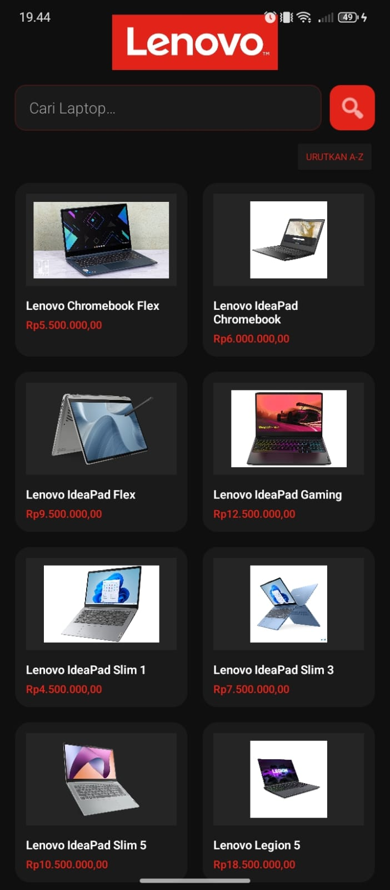
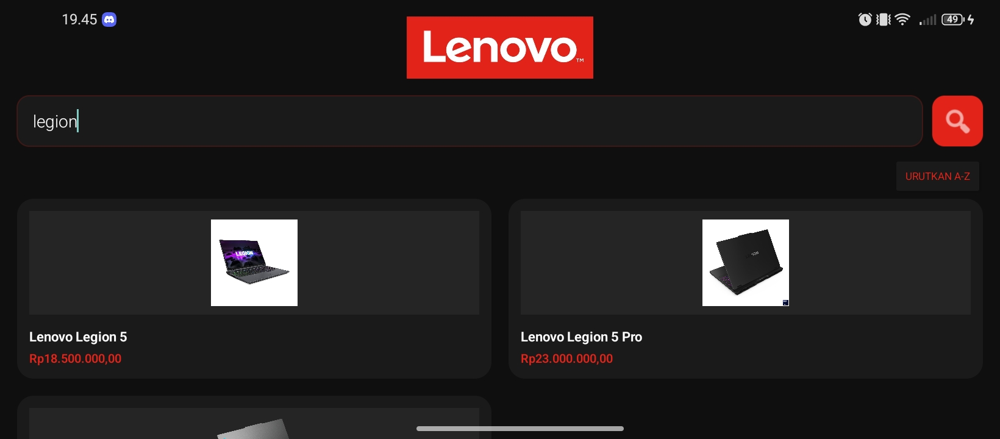
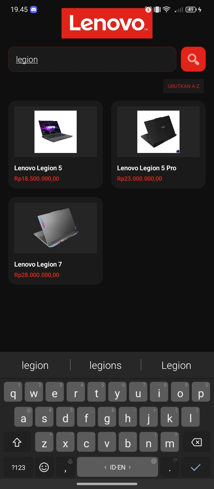
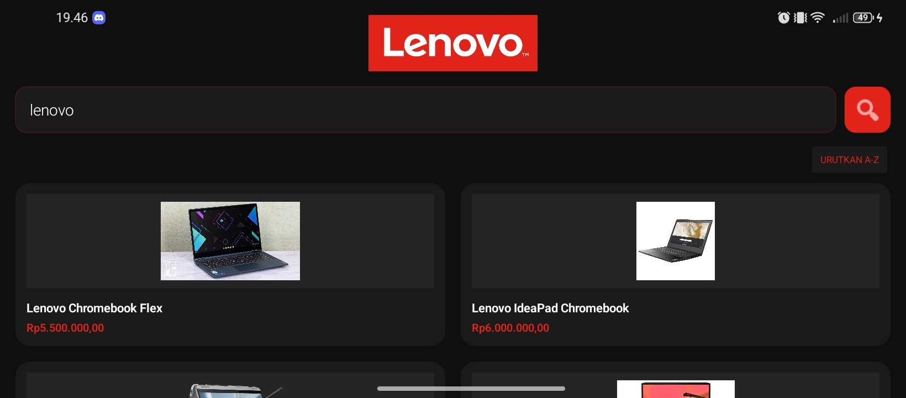
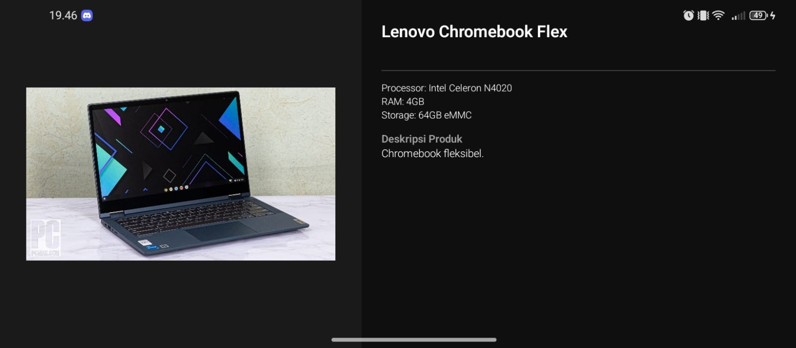
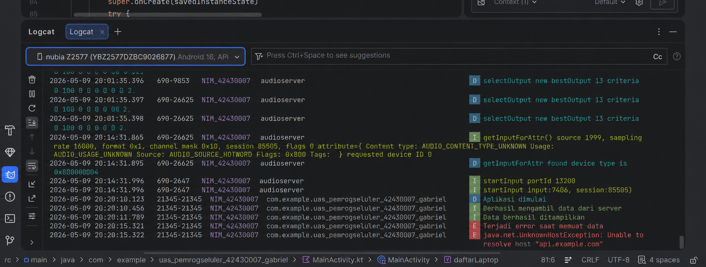

# UAS Pemrograman Seluler - Katalog Laptop Lenovo

## Informasi Mahasiswa
- **Nama:** Gabriel
- **NIM:** 42430007

---

## Topik Aplikasi
Aplikasi **Katalog Laptop Lenovo** adalah aplikasi Android sederhana yang memungkinkan pengguna untuk:

1. Menjelajahi daftar berbagai seri laptop Lenovo.
2. Mencari laptop berdasarkan nama menggunakan fitur pencarian.
3. Mengurutkan daftar laptop secara alfabetis (A-Z).
4. Melihat detail spesifikasi laptop seperti:
   - Processor
   - RAM
   - Storage
   - Graphics
   - Display
   - Harga
   - Deskripsi Produk

---

## Screenshot Aplikasi

Berikut adalah dokumentasi hasil pengujian aplikasi:

### 1. Tampilan Utama

| Mode Portrait | Mode Landscape |
| :---: | :---: |
|  |  |

---

### 2. Fitur Pencarian & Pengurutan

| Hasil Pencarian Data | Pengurutan (Sort A-Z) |
| :---: | :---: |
|  |  |

---

### 3. Halaman Detail Laptop

| Detail Laptop | Detail Laptop Landscape |
| :---: | :---: |
|  |  |

---

## Verifikasi Logcat (NIM)

Berikut adalah bukti Logcat di Android Studio yang menampilkan NIM mahasiswa.

| Logcat - NIM (42430007) |
| :---: |
|  |

---

## Teknologi yang Digunakan

- Kotlin
- Android Studio
- RecyclerView
- GridLayoutManager
- Material Design

---

## Fitur Aplikasi

- Menampilkan daftar laptop Lenovo
- Fitur pencarian laptop
- Fitur sorting data
- Detail spesifikasi laptop
- Responsive layout portrait & landscape
- Logging menggunakan Logcat Android Studio

---

## Struktur Folder Screenshot

```plaintext
images/
├── portrait.png
├── landscape.png
├── search.png
├── sort.png
├── detail.png
└── logcat.png
